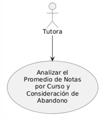
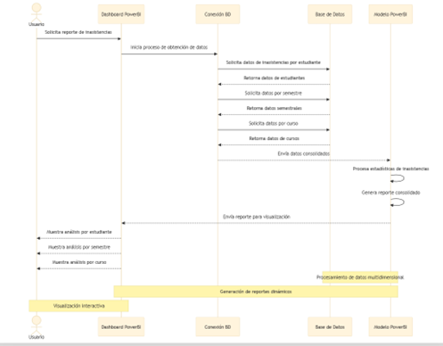
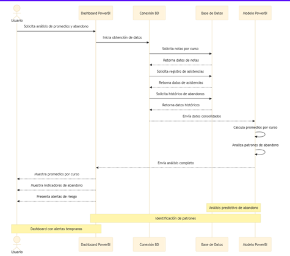

Logo de Mi Empresa		Logo de mi Cliente

**UNIVERSIDAD PRIVADA DE TACNA**

**FACULTAD DE INGENIERIA**

**Escuela Profesional de Ingeniería de Sistemas**

` `**Dashboard de Detección Temprana de Abandono Estudiantil para el area de tutoria EPIS UPT**

Curso:  *Inteligencia De Negocios*

Docente:  *Ing. Cuadros Quiroga, Patrick Jose*

Integrantes:

***Melendez Huarachi Gabriel Fari 		(2021070311)***

***Lopez Catunta, Brayar Christian 		(2020068946)***

***Briceño Diaz, Jorge Luis 				(2017059611)***

***Cuadros Garcia, Mirian 				(2021071083)***

***Hurtado Ortiz, Leandro 				(2015052384)***

***Chino Rivera, Angel Alessandro 		(2021069830)***

**Tacna – Perú**

***2024***

|CONTROL DE VERSIONES||||||
| :-: | :- | :- | :- | :- | :- |
|Versión|Hecha por|Revisada por|Aprobada por|Fecha|Motivo|
|1\.0|MPV|ELV|ARV|19/11/2024|Versión Original|

Sistema *Dashboard de Detección Temprana de Abandono Estudiantil para el area de tutoria EPIS UPT*

Documento de Especificación de Requerimientos de Software

Versión *{1.0}*

|CONTROL DE VERSIONES||||||
| :-: | :- | :- | :- | :- | :- |
|Versión|Hecha por|Revisada por|Aprobada por|Fecha|Motivo|
|1\.0|MPV|ELV|ARV|10/10/2020|Versión Original|

**INDICE GENERAL**

[INTRODUCCION	](#_heading=h.30j0zll)4

[I. Generalidades de la Empresa	](#_heading=h.1fob9te)5

`	`1. Nombre de la Empresa	5

`	`2. Vision	5

`	`3. Mision	5

`	`4. Organigrama	5

[II. Visionamiento de la Empresa	](#_heading=h.1fob9te)5

`	`1. Descripcion del Problema	5

`	`2. Objetivos de Negocios	5

`	`3. Objetivos de Diseño	5

`	`4. Alcance del proyecto	5

`	`5. Viabilidad del Sistema	5

`	`6. Informacion obtenida del Levantamiento de Informacion	6

[III.  Análisis de Procesos	](#_heading=h.1fob9te)6

`	`a) Diagrama del Proceso Actual – Diagrama de actividades	6

`	`b) Diagrama del Proceso Propuesto – Diagrama de actividades Inicial	7

[IV Especificacion de Requerimientos de Software	](#_heading=h.1fob9te)7

`	`a) Cuadro de Requerimientos funcionales Inicial	7

`	`b) Cuadro de Requerimientos No funcionales	7

`	`c) Cuadro de Requerimientos funcionales Final	8

`	`d) Reglas de Negocio	9

[V Fase de Desarrollo	](#_heading=h.1fob9te)12

`	`1. Perfiles de Usuario	12

`	`2. Modelo Conceptual	5

`	`a) Diagrama de Paquetes	5

`	`b) Diagrama de Casos de Uso	12

`	`c) Escenarios de Caso de Uso (narrativa)	14

[    3. Modelo Logico	](#_heading=h.1fob9te)23

`	`a) Análisis de Objetos	23

`	`b) Diagrama de Actividades con objetos	32

	c) Diagrama de Secuencia	37

`	`d) Diagrama de Clases	42

[CONCLUSIONES	](#_heading=h.2et92p0)46

[RECOMENDACIONES	](#_heading=h.tyjcwt)46

[BIBLIOGRAFIA	](#_heading=h.3dy6vkm)46

[WEBGRAFIA	](#_heading=h.1t3h5sf)46

INTRODUCCIÓN

I. Generalidades de la Empresa

1. Nombre de la Empresa

`	`Dashboard de Detección Temprana de Abandono Estudiantil para el área de tutoría de EPIS UPT

2. Visión

`	`Brindar una solución tecnológica avanzada que permita a la Universidad Privada de Tacna identificar tempranamente a estudiantes en riesgo de abandono académico, optimizando los procesos de tutoría mediante el uso de un sistema de análisis predictivo, con el fin de mejorar la retención estudiantil y garantizar el éxito académico.

3. Misión

`	`Desarrollar e implementar soluciones innovadoras, como el Dashboard de Detección Temprana de Abandono Estudiantil, que permitan identificar de manera proactiva a los estudiantes en riesgo, optimizando los procesos de tutoría y promoviendo estrategias efectivas para reducir el abandono estudiantil.

4. Organigrama

II. Visionamiento de la Empresa

1. Descripción del Problema

   El proceso actual de seguimiento y apoyo a los estudiantes en la Universidad Privada de Tacna enfrenta varios desafíos críticos relacionados con el abandono estudiantil:

- **Crecimiento en el número de estudiantes en riesgo**: A medida que aumenta la población estudiantil, se vuelve más difícil identificar y dar seguimiento a aquellos estudiantes que presentan un mayor riesgo de abandonar sus estudios.
- **Evaluación manual**: El proceso manual para identificar a los estudiantes en riesgo es propenso a errores, consume tiempo y es ineficiente, lo que retrasa las intervenciones oportunas por parte de tutores y administradores.
- **Criterios limitados**: Los criterios actuales para evaluar el riesgo de abandono no abarcan todos los factores que influyen en el éxito académico, como aspectos socioeconómicos o patrones de comportamiento.
- **Falta de herramientas tecnológicas**: La ausencia de herramientas avanzadas de análisis de datos y predicción limita la capacidad de la universidad para anticipar el abandono estudiantil y optimizar los recursos de apoyo.

El **Dashboard de Detección Temprana de Abandono Estudiantil** aborda estos problemas mediante el uso de técnicas de análisis de datos y aprendizaje automático, proporcionando una evaluación más precisa y eficiente del riesgo de abandono. Esto permite intervenciones tempranas y mejora las tasas de retención estudiantil.

2. Objetivos de Negocios

`	`El propósito principal de este proyecto es desarrollar una solución tecnológica que permita a la universidad identificar a los estudiantes en riesgo de abandonar sus estudios de manera temprana, con el fin de tomar medidas preventivas oportunas. Los objetivos de negocio incluyen:

- **Mejorar las tasas de retención estudiantil** a través de intervenciones más efectivas y personalizadas.
- **Optimizar el uso de los recursos institucionales** mediante la asignación adecuada de esfuerzos de tutoría y apoyo a los estudiantes en riesgo.
- **Fortalecer la reputación institucional** al demostrar un compromiso activo con la retención y el éxito académico de los estudiantes.
- **Reducir los costos asociados al abandono estudiantil**, aumentando el número de graduados y evitando la pérdida de estudiantes valiosos.
3. Objetivos de Diseño

`	`Los objetivos de diseño se centran en crear un sistema que sea tanto funcional como fácil de usar para los administradores y tutores de la universidad. Los objetivos de diseño incluyen:

- **Desarrollar un dashboard interactivo** que muestre información clara sobre los estudiantes en riesgo de abandono.
- **Integrar un modelo predictivo** basado en datos históricos y actuales, como rendimiento académico, asistencia, factores socioeconómicos, entre otros.
- **Ofrecer una plataforma intuitiva y accesible** para que los tutores y administradores puedan visualizar fácilmente los datos y tomar decisiones informadas.
- **Garantizar la seguridad y privacidad de los datos** personales y académicos de los estudiantes.
4. Alcance del Proyecto

`	`El alcance de este proyecto incluye el desarrollo, implementación y despliegue de un dashboard interactivo que integre un modelo predictivo basado en datos históricos y actuales de los estudiantes, como rendimiento académico, asistencia y factores socioeconómicos. El dashboard proporcionará a los administradores y tutores una plataforma para visualizar los niveles de riesgo, analizar tendencias y tomar decisiones informadas que mejoren la retención estudiantil.

5. Viabilidad del Sistema

`	`La viabilidad del **Dashboard de Detección Temprana de Abandono Estudiantil** se encuentra respaldada por la disponibilidad de tecnologías accesibles y avanzadas como el análisis de datos y el aprendizaje automático, que permiten la implementación de soluciones eficientes para la predicción del abandono estudiantil. Además, la universidad ya dispone de datos históricos relevantes sobre el rendimiento académico, asistencia y factores socioeconómicos de los estudiantes, lo que facilita la integración de estos datos en el sistema. Desde el punto de vista económico, la implementación del sistema se justifica por los beneficios a largo plazo, como la mejora en la retención estudiantil, la optimización de los recursos institucionales y el fortalecimiento de la imagen académica de la universidad. La utilización de herramientas y plataformas tecnológicas existentes en la universidad también hace que la implementación sea factible y rentable, asegurando un proceso de integración sin mayores complicaciones técnicas.

6. Información Obtenida del Levantamiento de Información

`	`**Entrevistas con administradores y tutores de EPIS**: Estas entrevistas han ayudado a identificar las necesidades específicas de los usuarios y las limitaciones del sistema actual.

`	`**Análisis de los datos históricos de los estudiantes**: Se ha recopilado información sobre el rendimiento académico, asistencia y otros datos relevantes de los estudiantes.

III. Análisis de Procesos

`      `a) Diagrama del Proceso Actual – Diagrama de Actividades

`      `b) Diagrama del Proceso Propuesto – Diagrama de Actividades Inicial

IV. Especificación de Requerimientos de Software

`      `a) Cuadro de Requerimientos Funcionales Inicial

|**ID**|**Descripción**|**Prioridad**|**Dependencia**|
| :-: | :-: | :-: | :-: |
|RF01|Permitir la carga de datos académicos y sociodemográficos de los estudiantes.|Alta|Ninguna|
|RF02|Generar visualizaciones dinámicas sobre patrones de deserción estudiantil.|Alta|RF01|
|RF03|Identificar estudiantes en riesgo basándose en indicadores clave como inasistencias y notas.|Alta|RF01, RF02|
|RF04|Permitir la exportación de reportes detallados con los datos de estudiantes en riesgo.|Media|RF03|
|RF05|Integrar filtros interactivos (edad, género, ciclo, curso, etc.) para personalizar las visualizaciones.|Media|RF02|
|RF06|Generar alertas automáticas para notificar a los tutores sobre estudiantes en riesgo.|Media|RF03|
|RF07|Permitir a los tutores registrar acciones de intervención realizadas con los estudiantes.|Baja|RF03, RF06|

`      `b) Cuadro de Requerimientos No Funcionales

|**ID**|**Descripción**|**Prioridad**|
| :-: | :-: | :-: |
|RNF01|El sistema debe ser accesible a través de navegadores modernos (Chrome, Firefox, Edge).|Alta|
|RNF02|El tiempo de respuesta de las consultas y visualizaciones no debe exceder los 2 segundos.|Alta|
|RNF03|La interfaz debe ser intuitiva y fácil de usar para tutores y docentes con conocimientos básicos en TI.|Alta|
|RNF04|La seguridad de los datos debe garantizar confidencialidad y cumplimiento con normas de protección de datos.|Alta|
|RNF05|El sistema debe soportar la carga de datos históricos de al menos 5 años.|Media|
|RNF06|Las visualizaciones deben ser compatibles con dispositivos móviles y tablets.|Media|
|RNF07|El sistema debe permitir actualizaciones automáticas para incorporar mejoras sin interrumpir su uso.|Baja|

`      `c) Cuadro de Requerimientos Funcionales Final

|**ID**|**Descripción**|**Prioridad**|**Dependencia**|
| :-: | :-: | :-: | :-: |
|RF01|Permitir la carga de datos académicos y sociodemográficos de los estudiantes, incluyendo notas, inasistencias y cursos.|Alta|Ninguna|
|RF02|Generar gráficos interactivos que muestran patrones de riesgo de abandono basados en variables clave.|Alta|RF01|
|RF03|Implementar un sistema de predicción que identifique estudiantes con alta probabilidad de deserción.|Alta|RF01, RF02|
|RF04|Facilitar la exportación de reportes en formato PDF o plantilla para uso de los tutores.|Media|RF03|
|RF05|Permitir la aplicación de filtros para personalizar los datos según género, edad, ciclo y curso.|Media|RF02|

`      `d) Reglas de Negocio

|**ID**|**Tipo de Regla de Negocio**|**Nombre de la Regla**|**Descripción**|**Proceso**|
| :-: | :-: | :-: | :-: | :-: |
|RN01|Restricción|Control de Acceso a Datos|Solo el personal autorizado podrá ingresar, modificar y visualizar los datos académicos y sociodemográficos.|Validación del rol del usuario al iniciar sesión.|
|RN02|Cálculo|Modelo de Predicción de Riesgo|El sistema calculará el riesgo de abandono estudiantil basado en un modelo predeterminado.|Aplicar algoritmo predictivo utilizando datos cargados por los usuarios autorizados.|
|RN03|Restricción|Acceso a Información Detallada|Solo tutores y docentes autorizados pueden acceder a detalles específicos de estudiantes en riesgo.|Validar rol del usuario antes de permitir el acceso a información sensible.|
|RN04|Notificación|Generación de Alertas|Las alertas automáticas serán enviadas únicamente a los tutores asignados.|Enviar notificaciones basadas en los resultados del modelo de predicción.|
|RN05|Registro|Documentación de Estrategias de Intervención|Cada estrategia de intervención debe registrar fecha, tipo de intervención y responsable.|Registrar datos en un formulario controlado dentro del sistema.|
|RN06|Restricción|Acceso Basado en Roles|Los accesos al sistema y las visualizaciones dependerán del rol del usuario (tutor, docente, administrador).|Configurar permisos según los roles definidos previamente.|
|RN07|Formato|Estandarización de Carga de Datos|Los datos cargados deben cumplir con el formato definido, como archivos CSV estructurados.|Validar formato y estructura del archivo antes de permitir la carga.|
|RN08|Gestión|Revisión de Indicadores|Los indicadores clave de desempeño (KPI) serán revisados semestralmente por la dirección de EPIS.|Revisión y actualización de métricas en reuniones de planificación semestral.|
|RN09|Archivado|Conservación de Datos Históricos|Los datos no podrán eliminarse, pero podrán archivarse después de cinco años.|Implementar un proceso de archivado automático según antigüedad de los registros.|
|RN10|Trazabilidad|Identificación de Reportes|Cada reporte generado debe incluir un identificador único y la fecha de creación.|Agregar metadatos únicos a cada reporte generado.|
|RN11|Restricción|Filtros Interactivos Respetando Confidencialidad|Los filtros aplicados a visualizaciones deben respetar restricciones de acceso a datos confidenciales.|Aplicar restricciones automáticas según las reglas de confidencialidad al filtrar datos.|
|RN12|Aprobación|Ajustes en el Modelo Predictivo|Cualquier ajuste en el modelo predictivo debe ser aprobado por el área de tutoría antes de su implementación.|Validar aprobación antes de realizar cambios en el sistema.|

V. Fase de Desarrollo

1. Perfiles de Usuario
- **Administrador del Sistema**
  Persona encargada de gestionar los accesos, roles de usuario y garantizar el mantenimiento técnico del dashboard.
- **Tutor Académico**
  Responsable de monitorear el progreso académico de los estudiantes, identificar a aquellos en riesgo y registrar estrategias de intervención.
- **Docente**
  Profesor que analiza los datos de su curso para identificar patrones de riesgo y colaborar en la implementación de estrategias específicas.
- **Director Académico**
  Autoridad que supervisa el desempeño académico institucional, ajusta indicadores clave y toma decisiones estratégicas para mejorar la retención estudiantil.
- **Estudiante (Usuario Indirecto)**
  Principal beneficiario de las estrategias generadas por el sistema, mejorando su experiencia académica gracias al acompañamiento personalizado.

2. Modelo Conceptual

   a) Diagrama de Paquetes

   b) Diagrama de Casos de Uso

- ***Diagrama de CU01** “Generar gráfico estadístico de alumnos por curso Visualizar ranking de cursos por cantidad de estudiantes”* 

- ***Diagrama de CU02** “Generar Análisis y Reporte de Inasistencias por Estudiante, Semestre y Curso”* 

- ***Diagrama de CU03** “Analizar el Promedio de Notas por Curso y Consideración de Abandono.”* 

- ***Diagrama de CU04** “Identificar Estudiantes en Riesgo de Abandono mediante el Análisis de Faltas y Rendimiento Académico”* 

- ***Diagrama de CU05** “*Generar” 
- ***Diagrama de CU06** “*Generar” 
 

c) Escenarios de Caso de Uso (narrativa)

|**Generar Gráfico Estadístico de Alumnos por Curso**| |
| :-: | :- |
|**Tipo**|**Obligatorio**|
|**Actores**|Administrador, Sistema|
|**Descripción**|Este caso de uso permite al administrador generar gráficos estadísticos para visualizar el ranking de cursos por cantidad de estudiantes, así como filtrar los cursos por ciclo académico.|
|**Precondiciones**| - El sistema debe contar con datos actualizados de matrículas de los estudiantes. - El usuario debe haber iniciado sesión en el sistema.|
|**Narrativa de caso de uso**| |
|**Acción del usuario**|**Respuesta del sistema**|
|El administrador selecciona la opción de "Gráficos Estadísticos".|El sistema muestra una lista de opciones para generar gráficos.|
|El administrador selecciona el gráfico de ranking por cantidad de estudiantes.|El sistema genera y muestra el gráfico correspondiente.|
|El administrador aplica un filtro por ciclo académico.|El sistema actualiza el gráfico aplicando el filtro seleccionado.|

---

|**Generar Análisis y Reporte de Inasistencias por Estudiante, Semestre y Curso**| |
| :-: | :- |
|**Tipo**|**Obligatorio**|
|**Actores**|Tutor, Sistema|
|**Descripción**|Este caso de uso permite analizar y generar reportes sobre las inasistencias de los estudiantes, categorizadas por semestre y curso, para identificar patrones y posibles problemas.|
|**Precondiciones**| - El sistema debe contar con registros de asistencia actualizados. - El usuario debe contar con permisos para generar reportes.|
|**Narrativa de caso de uso**| |
|**Acción del usuario**|**Respuesta del sistema**|
|El tutor selecciona "Análisis de Inasistencias" en el menú del sistema.|El sistema solicita los parámetros del análisis (estudiante, semestre, curso).|
|El tutor elige los parámetros y confirma la acción.|El sistema genera y muestra el análisis en forma de gráfico y tabla.|
|El tutor selecciona la opción de generar reporte.|El sistema descarga el reporte en formato PDF o Excel.|

---

|**Analizar el Promedio de Notas por Curso y Consideración de Abandono**| |
| :-: | :- |
|**Tipo**|**Obligatorio**|
|**Actores**|Tutor, Sistema|
|**Descripción**|Este caso de uso permite al tutor analizar el promedio de notas de los estudiantes por curso y categorizar el riesgo de abandono.|
|**Precondiciones**| - El sistema debe contar con los promedios de notas registrados. - El usuario debe tener permisos para visualizar datos académicos.|
|**Narrativa de caso de uso**| |
|**Acción del usuario**|**Respuesta del sistema**|
|El tutor selecciona "Promedio de Notas" en el dashboard.|El sistema solicita seleccionar el curso a analizar.|
|El tutor selecciona un curso y solicita el análisis.|El sistema muestra un gráfico con el promedio de notas y una categorización de riesgo de abandono.|
|El tutor solicita exportar el análisis.|El sistema genera un archivo descargable con los resultados.|

---

|**Identificar Estudiantes en Riesgo de Abandono mediante Análisis de Faltas y Rendimiento Académico**| |
| :-: | :- |
|**Tipo**|**Obligatorio**|
|**Actores**|Tutor, Sistema|
|**Descripción**|Este caso de uso permite identificar estudiantes en riesgo de abandono al analizar la relación entre sus faltas y rendimiento académico.|
|**Precondiciones**| - El sistema debe contar con datos históricos de asistencia y calificaciones. - El tutor debe tener acceso autorizado.|
|**Narrativa de caso de uso**| |
|**Acción del usuario**|**Respuesta del sistema**|
|El tutor selecciona "Análisis de Riesgo de Abandono" en el sistema.|El sistema solicita los criterios de análisis (faltas, calificaciones, etc.).|
|El tutor establece los criterios y solicita el análisis.|El sistema genera un listado de estudiantes en riesgo con gráficos asociados.|
|El tutor selecciona un estudiante para un análisis detallado.|El sistema muestra un perfil con el análisis completo del estudiante seleccionado.|

---

|**Consultar Cruces de Horarios**| |
| :-: | :- |
|**Tipo**|**Obligatorio**|
|**Actores**|Administrador, Sistema|
|**Descripción**|Este caso de uso permite al administrador analizar los cruces de horarios de los estudiantes y evaluar su impacto en el rendimiento académico.|
|**Precondiciones**| - Los horarios y matrículas de los estudiantes deben estar actualizados en el sistema. - El usuario debe tener permisos para acceder a estos datos.|
|**Narrativa de caso de uso**| |
|**Acción del usuario**|**Respuesta del sistema**|
|El administrador selecciona "Análisis de Horarios" en el sistema.|El sistema solicita seleccionar el período académico y el estudiante.|
|El administrador selecciona un estudiante y solicita el análisis.|El sistema muestra una tabla con los cruces de horarios detectados y su impacto.|
|El administrador solicita un reporte del análisis.|El sistema genera un archivo descargable con los datos.|

3. Modelo Lógico

   a) Análisis de Objetos

|INTERFAZ|CONTROL|ENTIDAD|
| :-: | :-: | :-: |
|Dashboard Power bi|Script terraform|Base de datos|
|Github|Github actions|Modelo Power bi|
||Conexión a la base de datos||

b) Diagrama de Actividades con Objetos

1. “Generar gráfico estadístico de alumnos por curso Visualizar ranking de cursos por cantidad de estudiantes” .

2. “Generar Análisis y Reporte de Inasistencias por Estudiante, Semestre y Curso” 

3. “Analizar el Promedio de Notas por Curso y Consideración de Abandono.” 

4. “Identificar Estudiantes en Riesgo de Abandono mediante el Análisis de Faltas y Rendimiento Académico” 

c) Diagrama de Secuencia

1. “Generar gráfico estadístico de alumnos por curso Visualizar ranking de cursos por cantidad de estudiantes” .

2. Generar gráficos interactivos que muestran patrones de riesgo de abandono basados en variables clave.

3. “Analizar el Promedio de Notas por Curso y Consideración de Abandono.” 

4. “Identificar Estudiantes en Riesgo de Abandono mediante el Análisis de Faltas y Rendimiento Académico” 

d) Diagrama de Clases

CONCLUSIONES

- Impacto del Dashboard: La implementación de un dashboard interactivo permite una identificación más precisa y oportuna de estudiantes en riesgo de abandono, optimizando el uso de recursos de tutoría.
- Viabilidad: Se confirmó la viabilidad técnica y económica del proyecto gracias al uso de datos históricos y tecnologías de análisis predictivo.
- Reducción del abandono: El sistema propuesto mejora la retención estudiantil mediante intervenciones más efectivas.
- Innovación tecnológica: Este proyecto resalta el valor de la inteligencia de negocios y el aprendizaje automático en la educación.

RECOMENDACIONES

- Capacitación continua: Se recomienda entrenar regularmente al personal en el uso de la herramienta y en la interpretación de los resultados.
- Actualización del sistema: Es crucial mantener actualizado el modelo predictivo para adaptarse a cambios en patrones de abandono.
- Privacidad de datos: Garantizar la seguridad y confidencialidad de la información del estudiante para cumplir con las normativas.
- Monitoreo constante: Realizar evaluaciones periódicas del impacto del sistema para mejorar su efectividad.

BIBLIOGRAFÍA

WEBGRAFÍA
29

